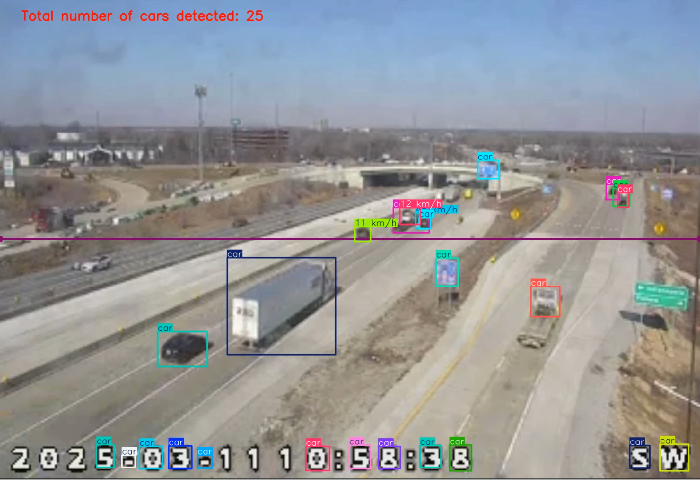
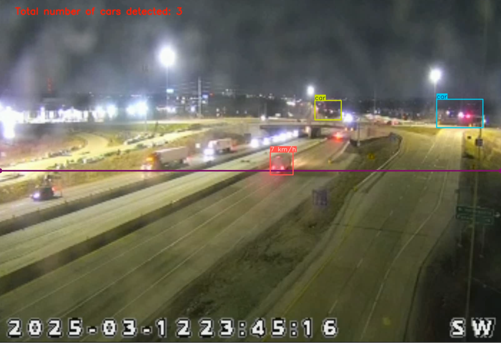
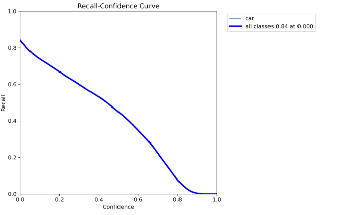
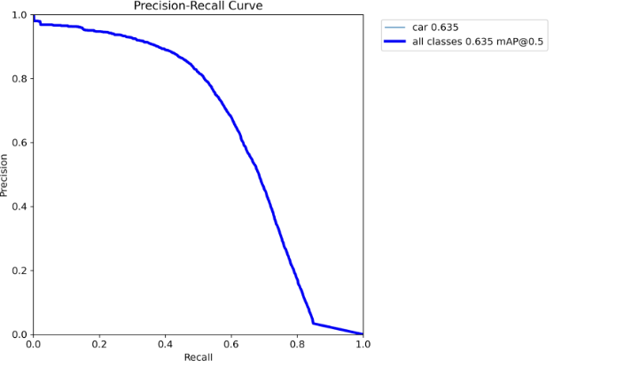
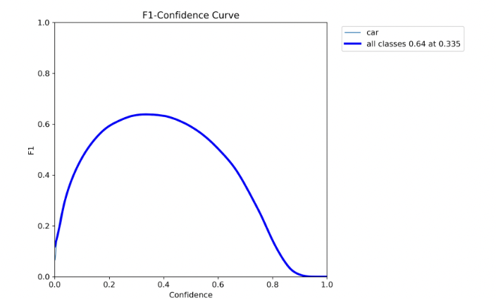

# Fine-Tuning YOLO11n for Traffic Detection
Analyzing traffic congestion by leveraging computer vision and machine learning algorithms to detect cars and each car's speed is essential in understanding traffic patterns that
may lead to congestion. A prominent advantage of monitoring traffic this way is the increased ability to estimate the speed and flow of vehicles to understand current traffic 
conditions without having to resort to the installation of additional equipment or sensors on top of surveillance equipment currently monitoring the highway. Urban city planners
can use this information to better traffic signal timing and develop better highway infrastructure.

## Technical Approach
The original pre-trained YOLO11n model was fine-tuned using the publicly available STREETS dataset from Kaggle (courtesy of Ryan Kraus). A minor modification to the text file was
made to help the model locate the training, testing, and validation datasets directory, before the input training data is resized to 640 x 640 pixels. 
The Python-based model was then trained, tested, and validated against a little over 10000 pieces of data over 3 epochs, lasting over 135 minutes, with each epoch lasting over 
45 minutes each. 
This results in the generation of a series of custom weights with a .pt extension, given that said models were PyTorch based, with the best weight being chosen for conducting the 
inference.
Inference and object detection was conducted against footage of a traffic camera situated at the I-465 Eastbound, hosted by the Indiana Department of Public Transport (INDOT).
Since a technical implementation that enables the current model to run an inference against a live footage has not yet been developed, the decision was made to screen record the 
live footage for 30 seconds before the inference was run against the locally stored footage. 
A custom Python script was written that utilizes the Ultralytics and CV2 computer vision python libraries to make speed estimations and calculate the numbers of vehicles 
detected cruising down the stretch of road at any one time and estimate each vehicle's speed.
The moving objects were tracked by drawing bounding boxes and along with the number of tracked vehicles were displayed on the inference video and saved in the .avi format.

## Inference
Inference was run using the fine-tuned model on the same stretch of road during day and night time, where we can clearly see that the model fared better during day time object
detection and speed inference, despite its tendency to "overdetect" objects that obviously aren't cars.

### Results
#### Recall Confidence
During evaluation, the fine-tuned YOLO11n model managed to achieve a maximum recall value of 0.84 in the ROC curve. The recall rate tends to drop at a much slower rate as confidence
thresholds increase, producing a rather stable result.

#### Precision Recall
The fine-tuned model achieved a mean average precision (mAP) of 0.635 at an IoU threshold of 0.5, meaning that there is still a significant room for improvement with regards to
object detection. The closer the mAP coefficient is to 1 the better.

#### F1 Confidence
The fine-tuned model achieved a peak F1 score of 0.64 at a 0.335 confidence threshold, implying that it has a moderately high threshold in distinguishing cars from background 
objects.

#### Confusion Matrix
The fine-tuned model's True Positive value is 0.65 meaning that it correctly classified the moving object as a car 65% of the time and a False Negative value of 0.35, which implies
that it mistook a background object for a car 35% of the time. The model also obtained a False Positive value of 1.0, and a True Negative score of 0. 

The confusion matrix below reinforces the notion that the model has a strong bias in predicting some background objects as cars.

## Published works
Our publication details how the fine-tuned model represents a substantial improvement from the pre-trained one and can be accessed in the link below
> https://docs.google.com/document/d/1YdmuXx7hG0kWXgrNXqtg1mlAJIcrrtJB/edit?usp=sharing&ouid=108563192688099272215&rtpof=true&sd=true

## Acknowledgements

Amanda Huang (huan1746@purdue.edu)

Christopher Budiharto (cbudihar@purdue.edu)

Saachi Katariya (skatariy@purdue.edu)

Ryan Kraus (https://www.kaggle.com/ryankraus)
